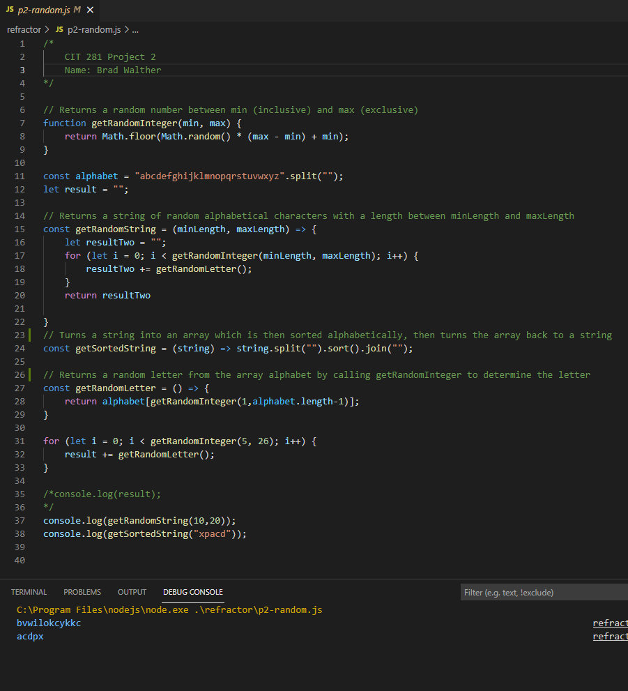

# Welcome to the Cit 281 Project 2 Page

### What I learned:

- Working with strings and arrow functions.
- Using Git through CLI and introducing using Git through Visual Studio Code Source Control.
- Practicing refactoring javascript code.

### Purpose of Project:

- We used CLI to create folders and initialize Git repositories.
- Practiced using arrow functions and assigning variables to a function output.
- This project also introduced us to VsCode Source Control, which can be used for Git.
- Gave us practice for refactoring code.

### Outcome pics:

### [**Back to home page**](https://uo-cit-itsbread33.github.io/ItsBread33.github.io/)
